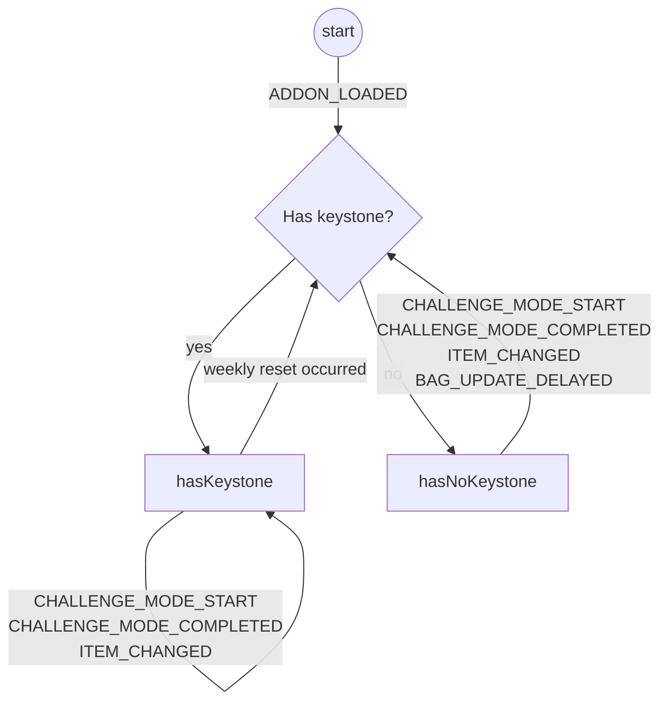

# State Machine

As is natural with WoW's event API, this addon follows a state machine:

Not included in the above state machine is handling of
`CHALLENGE_MODE_MAPS_UPDATE`, which prompts a keystone check and -- regardless
of the result -- unregisters from `CHALLENGE_MODE_MAPS_UPDATE`.
